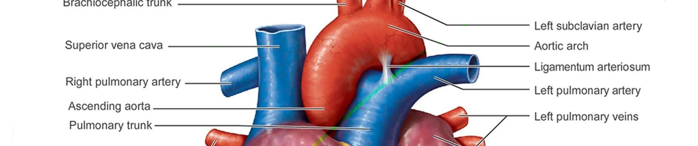

# Heart Attack Prediction 

## Machine Learning Zoomcamp | 2024 Cohort | Midterm Project 

Author: [*Diego Gutierrez*](https://www.linkedin.com/in/diego-gutierrez-1874b17b/) 

-------



-----

## Table of Contents:

* [Problem Statement](#problem-statement)
* [Tools & Technology](#tools--technology)
* [Architecture Diagram](#architecture-diagram)
* [Data Sources & Schema](#data-sources--schema)
* [Model Training & Selection](#model-training--selection)
* [Project Structure](#project-structure)
* [Reproducibility](#reproducibility)
* [Further Ideas & Next Steps](#further-ideas--next-steps)
* [Acknowledgements & Credits](#acknowledgements--credits)

    >**NOTE;** _to skip the project overview & head staight to use the model, click [here](#reproducibility)_

------------------------

### Problem Statement  

Heart disease is one of the leading causes of death worldwide, with Coronary Artery Disease (CAD) being a major contributor. CAD is a chronic condition where the coronary arteries become narrowed or blocked, reducing blood flow to the heart muscle. If left undiagnosed and untreated, CAD can lead to severe complications, including a heart attack. Early detection and intervention are critical for preventing such outcomes.  

This project aims to leverage machine learning to predict the probability of CAD and assess whether a patient is at risk of heart disease based on clinical data.  

The solution involves:  
1. Training and evaluating four different machine learning models: Logistic Regression, Decision Tree, Random Forest, and XGBoost.  
2. Selecting the best-performing model based on the **ROC AUC Score**, which evaluates the model's ability to distinguish between patients with and without CAD.
3. Deploying the chosen model using Docker to AWS Elastic Beanstalk, enabling scalable access through an API.  

The deployed API will allow users to input patient data and receive real-time predictions of CAD probability. This tool can empower healthcare providers with actionable insights for early diagnosis and improved patient outcomes.  

______________________________________________

### Tools & Technology

* **Containerization**: [Docker](https://www.docker.com/)
* **Model Deployment**: [AWS Elastic Beanstalk](https://aws.amazon.com/elasticbeanstalk/)
* **Machine Learning Models**: [Logistic Regression](https://scikit-learn.org/stable/modules/generated/sklearn.linear_model.LogisticRegression.html), [Decision Tree](https://scikit-learn.org/stable/modules/generated/sklearn.tree.DecisionTreeClassifier.html), [Random Forest](https://scikit-learn.org/stable/modules/generated/sklearn.ensemble.RandomForestClassifier.html), [XGBoost](https://xgboost.readthedocs.io/en/stable/)
* **Dependency Management**: [Pipenv](https://pipenv.pypa.io/en/latest/)
* **Notebooks**: [Jupyter Notebook](https://jupyter.org/)
______________________________________________

### Architecture Diagram


------------------------

### Data Sources & Schema

The dataset used in this project is designed to support heart disease prediction and analysis, specifically assessing coronary artery disease (CAD) through various health metrics, such as, age, cholesterol levels, and chest pain types, provides a foundation for building predictive models for heart disease. The data was obtained from Kaggle and is available at [Heart Attack Analysis & Prediction Dataset](https://www.kaggle.com/datasets/rashikrahmanpritom/heart-attack-analysis-prediction-dataset/data).

The CSV file, `heart.csv`, contains information related to patient health metrics and the dataset is provided in the `data` directory. Below are the columns included in the dataset:

* **age**: Age of the patient in years.
* **sex**: Sex of the patient (0 = female; 1 = male).
* **cp**: Chest pain type (0 = asymptomatic; 1 = typical angina; 2 = atypical angina; 3 = non-anginal pain).
* **trtbps**: Resting blood pressure (measured in mm Hg at hospital admission).
* **chol**: Serum cholesterol in mg/dl.
* **fbs**: Fasting blood sugar (>120 mg/dl; 1 = true, 0 = false).
* **restecg**: Resting electrocardiographic results (0 = normal; 1 = ST-T wave abnormality; 2 = left ventricular hypertrophy).
* **thalachh**: Maximum heart rate achieved.
* **exng**: Exercise-induced angina (0 = no; 1 = yes).
* **oldpeak**: ST depression induced by exercise relative to rest.
* **slp**: Slope of the peak exercise ST segment (0 = downsloping; 1 = upsloping; 2 = flat)
* **caa**: Number of major vessels (0-3) colored by fluoroscopy.
* **thall**: Thalassemia type (1 = fixed defect; 2 = normal; 3 = reversible defect).
* **output**: Diagnosis of heart disease (angiographic disease status; 0 = <50% diameter narrowing, 1 = >50% diameter narrowing).

#### Medical Definitions

1. **Angina**  
   Angina is a type of chest pain or discomfort caused by reduced blood flow to the heart muscle. It is often a symptom of coronary artery disease and can feel like pressure, squeezing, or tightness in the chest.  

2. **Cholesterol**  
   Cholesterol is a waxy, fat-like substance found in the blood. While the body needs cholesterol to build healthy cells, high levels can lead to the development of fatty deposits in blood vessels, increasing the risk of heart disease and stroke.  

3. **ECG (Electrocardiogram)**  
   An ECG is a medical test that measures the electrical activity of the heart. It is used to detect heart conditions by recording the heart’s rhythm and electrical signals, helping identify abnormalities like arrhythmias or ischemia.  

4. **ST Depression**  
   ST depression refers to a downward shift of the ST segment on an ECG, which may indicate myocardial ischemia (reduced blood flow to the heart) or other conditions like electrolyte imbalances or cardiac strain.  

5. **Thalassemia**  
   Thalassemia is an inherited blood disorder characterized by the body’s inability to produce adequate hemoglobin, the protein in red blood cells that carries oxygen. This condition can lead to anemia and other complications, varying in severity depending on the type.  

______________________________________________

### Model Training & Selection

The entire model training and selection process is documented in the Jupyter Notebook located [HERE](notebooks/notebook.ipynb).  

In this notebook:  
1. The dataset was loaded from a CSV file into a Pandas DataFrame.  
2. Data cleaning and preprocessing steps were performed to handle missing values and prepare the data for modeling.  
3. Exploratory Data Analysis (EDA) was conducted to gain insights into the data distribution and relationships between features.  
4. Four different machine learning models (Logistic Regression, Decision Tree, Random Forest, and XGBoost) were trained and hyperparameters were tuned.  
5. Each model was evaluated using the **ROC AUC Score**, which measures the ability to distinguish between patients with and without CAD.  

The best-performing model, based on the ROC AUC Score, was selected for deployment.

### Project Structure  

- **[data](data)** - Folder with dataset files.  
  - **[heart.csv](data/heart.csv)** - Raw heart patient data.
- **[images](images)** - Folder with visual assets for the project.  
  - **[heart.jpg](images/heart.jpg)** - Image of a heart used in documentation or visualization.  
  - **[heart_attack_model_diagram.drawio.svg](images/heart_attack_model_diagram.drawio.svg)** - Diagram visualizing the machine learning model pipeline.
- **[models](models)** - Folder for storing trained model artifacts.  
  - **[model.bin](models/model.bin)** - Serialized machine learning model (created during training).  
- **[notebooks](notebooks)** - Folder containing Jupyter notebooks.  
  - **[notebook.ipynb](notebooks/notebook.ipynb)** - Main notebook for EDA, data preparation, and model training.  
- **[src](src)** - Folder with Python scripts for core functionality.  
  - **[predict.py](src/predict.py)** - Script to serve the model for predictions.  
  - **[train.py](src/train.py)** - Script to train the machine learning model.  
- **[tests](tests)** - Folder containing test scripts.  
  - **[predict_test.py](tests/predict_test.py)** - Unit test for the prediction functionality.  
- **Project Root Files**  
  
  - **[Pipfile](Pipfile)** - Dependency file for the project environment.  
  - **[Pipfile.lock](Pipfile.lock)** - Locked dependency versions.  
  - **[README.md](README.md)** - Documentation file for project description.  
  - **[Dockerfile](Dockerfile)** - Dockerfile for containerizing the application.  
  - **[.dockerignore](.dockerignore)** - File specifying files to ignore during Docker build.
  - **[.gitignore](.gitignore)** - Specifies files to ignore in version control.  

### Reproducibility

  >**NOTE;** _During the Zoomcamp evaluation process, the project will already be live on the cloud. Therefore, after activating the environment, you can skip to step 7 to use the API and ignore deployment steps 5 and 6._

1. Clone the repository.
```bash
git clone https://github.com/dieegogutierrez/heart-attack-model.git
```
2. Move to the project directory.
```bash
cd heart-attack-model
```
3. Create the environment.
```bash
pipenv install
```
4. Activate the environment.
```bash
pipenv shell
```
5. Deploy the model locally with Docker.
```bash
docker build -t heart-attack-prediction .  
docker run -it -p 9696:9696 heart-attack-prediction:latest
```
6. Deploy the model on AWS cloud Elastic Beanstalk.

- Generate Access Keys. Click on User at right up corner > Security Credentials > Access Keys
- Initiate docker container on Elastic Beanstalk. A prompt to enter ID and Key will show.
```bash
eb init -p docker heart-attack-prediction
eb create heart-attack-prediction-env --enable-spot
```
- A URL will show at the end under `CNAME`. Update the file **[predict_test.py](tests/predict_test.py)** with the URL in order to test your API serving.
- Terminate the cloud serving.
```bash
eb terminate heart-attack-prediction-env
```
7. Test the API.
```bash
cd tests
python predict_test.py
```
- Update the file **[predict_test.py](tests/predict_test.py)** with different patient information to test others.

-----------------------------

### Further Ideas & Next Steps

- Use different hyperparameters tuning.
- Use different models.
- Use machine learn to fill the missing values instead of deleting them.

-----------------------------

### Acknowledgements & Credits

Acknowledgement to [DataTalksClub](https://datatalks.club/)! for mentoring us through the Machine Learn Zoom Camp. It has been a privilege to take part in the '24 Cohort, go and check them out!
 
> "DataTalks.Club - the place to talk about data! We are a community of people who are passionate about data. Join us to talk about everything related to data, to learn more about applied machine learning with our free courses and materials, to discuss the engineering aspects of data science and analytics, to chat about career options and learn tips and tricks for the job interviews, to discover new things and have fun!

> Our weekly events include:

> 👨🏼‍💻 Free courses and weekly study groups where you can start practicing within a friendly community of learners

> 🔧 Workshops where you can get hands-on tutorials about technical topics

> ⚙️ Open-Source Spotlight, where you can discover open-source tools with a short demo video

> 🎙 Live Podcasts with practitioners where they share their experience (and the recordings too)

> 📺 Webinars with slides, where we discuss technical aspects of data science"

[Data Talks Club](https://www.linkedin.com/company/datatalks-club/)

---------------------------